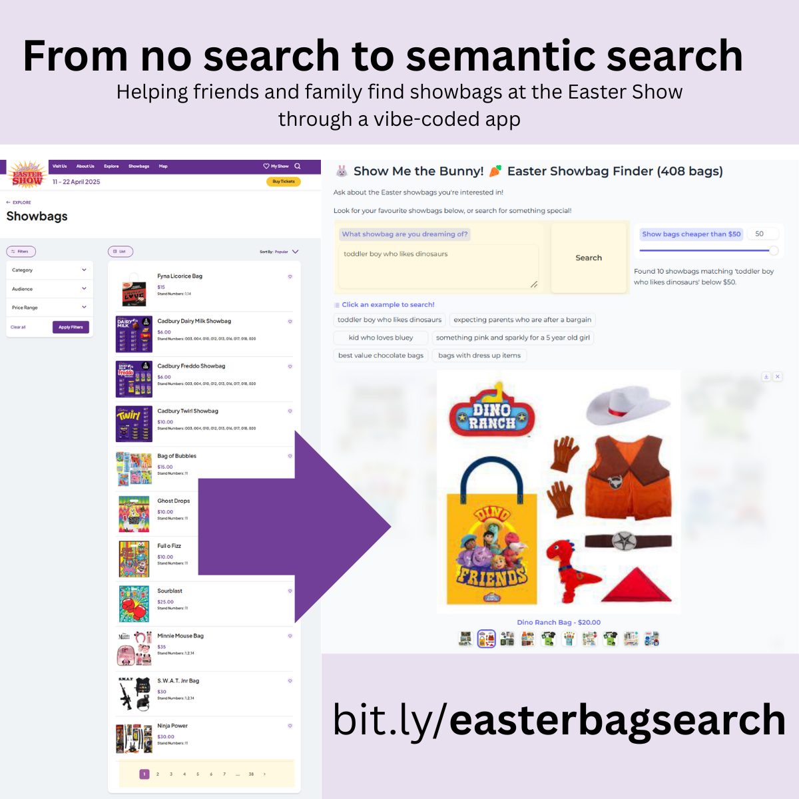

# Show me the bunny

## Overview
"Show me the bunny" is a simple LLM app for helping parents and kids find and choose their 2025 Sydney Royal Easter Show show-bag. 

What is the royal easter show? A big country fair held in Sydney on the weeks before and after Easter - [link](https://www.eastershow.com.au/)

Credit to the show organisers for uploading all the showbag details to their website. As there was no way to search it, this app was created.

You can find the app deployed to modal on this link: [https://bit.ly/easterbagsearch](https://bit.ly/easterbagsearch)



The project contains various experiments, data processing scripts, and analysis notebooks.

## Project Structure
```
show-me-the-bunny/
│
├── apps/                       # Application experiments
│   ├── v0/                     # Initial application version, llamaindex
│   └── v1/                     # Second application version, abandoned
│   └── v2/                     # Third application version, deployed to modal
│
├── data/                       # Raw and processed data files
│   ├── showbags/               # Showbag-related data and scripts
│   └── show-guide-2025.pdf     # Show guide
│
├── notebooks/                  # Jupyter notebooks for prototyping
│
├── scratch/                    # Temporary and experimental code
│
├── .env                        # Environment variables (API keys, etc.)
├── .gitignore                  # Files ignored by git
├── .python-version             # Python version specification (3.11)
└── README.md                   # Project documentation (this file)
```

## Getting Started

### Prerequisites
- Python 3.11
- Virtual environment (.venv)

### Installation
1. Clone the repository
2. Set up the virtual environment:
   ```bash
   python -m venv .venv
   source .venv/bin/activate  # On Windows: .venv\Scripts\activate
   ```
3. Install the required dependencies:
   ```bash
   pip install -r apps/v2/requirements.txt
   ```

## Application Versions

### v0
The initial prototype version of the application. Didn't do too well with the raw data, so we're going to try enriching using a multi-modal model and the image url's. 

### v1
Abandoned.

### v2
Ultimately the app that was deployed - uses an image carousel, tries to have some prompts ready, and allows price filtering.

## Data Sources
The project uses data extracted from the Sydney 2025 Easter Show Website: https://www.eastershow.com.au/

## Analysis
Exploratory data analysis is performed in the Jupyter notebooks located in the `notebooks/` directory. These notebooks provide insights into the patterns and trends within the show data.

## Environment Variables
The project requires various API keys, which are stored in the `.env` file:
- BASETEN_API_KEY: For accessing Baseten hosted models
- OPENAI_API_KEY: For accessing OpenAI services

**Note:** Remember to create your own `.env` file with your API keys when setting up the project.

## Contributing
1. Create a new branch for your feature or fix
2. Implement your changes
3. Test thoroughly (and given this is vibe coding the bar is set low!)
4. Submit a pull request
